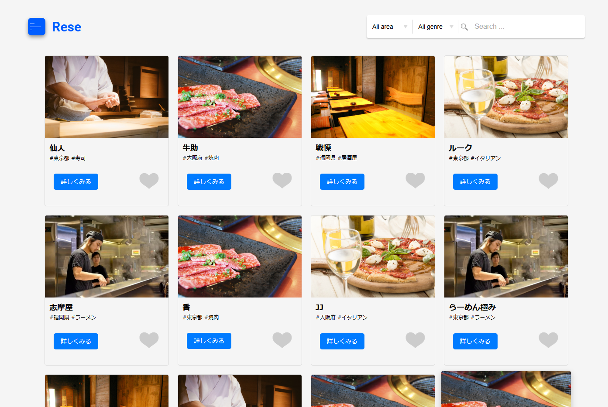
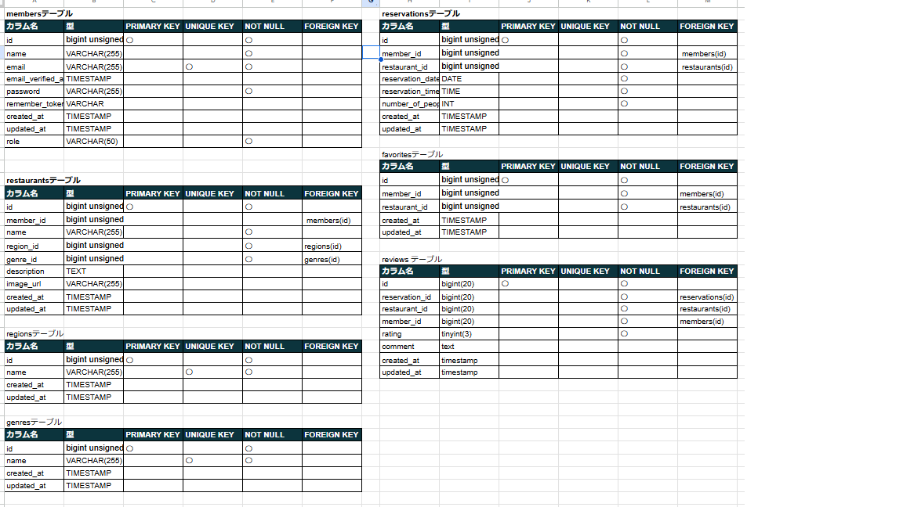
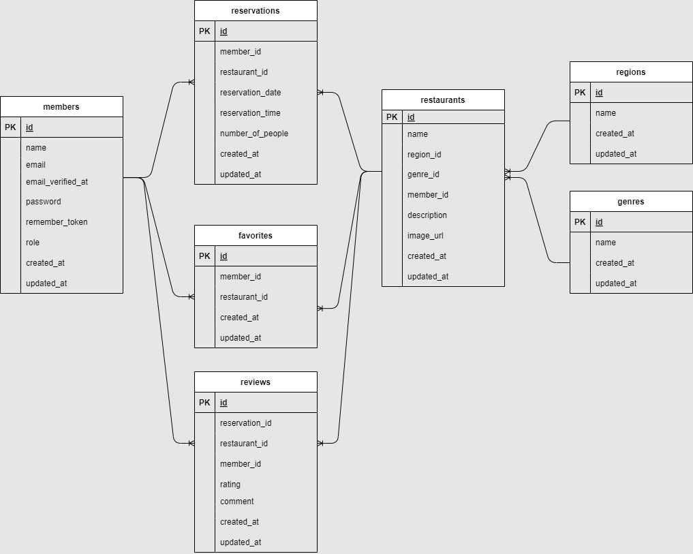

<p align="center"><a href="https://laravel.com" target="_blank"></a></p>

<p align="center">
<a href="https://travis-ci.org/laravel/framework"></a>
<a href="https://packagist.org/packages/laravel/framework"></a>
<a href="https://packagist.org/packages/laravel/framework"></a>
<a href="https://packagist.org/packages/laravel/framework"></a>
</p>

# 飲食店予約サービスアプリ -RESE

**RESE**は、飲食店の予約とレビュー管理を簡単に行えるシステムです



## 作成した目的

上級模擬案件を通して実践に近い開発経験をつむため作成しました。

## アプリケーション URL

http://3.112.210.128

## 機能一覧

-   会員登録・ログイン機能
-   レストラン検索機能
-   レストラン詳細表示
-   予約の作成・更新・削除
-   レビュー投稿・閲覧機能
-   お気に入り登録機能

**追加機能**

-   予約変更機能
-   ５段階評価・レビュー機能
-   バリデーション機能
-   メール認証
-   QR コード
-   管理画面
-   お知らせメール送信
-   リマインダーメール送信
-   レスポンシブデザイン
-   ストレージ保管
-   決済機能
-   AWS環境構築
-   開発環境と本番環境の切り分け

## 使用技術

-   フレームワーク: Laravel 8.x
-   データベース: MySQL 8.x
-   サーバー: Nginx
-   PHP: 8.1
-   Node.js: 14.x or higher
-   Composer: 2.x
-   Docker
-   Stripe
-   javascript
-   OS: Amazon Linux 2023
    **その他**: AWS（S3, EC2, RDS）を使用した本番環境構築

## テーブル設計



## ER 図

以下は、本プロジェクトで使用しているデータベースの ER 図です：



## 環境構築

1. リポジトリをクローン
    ```bash
    git clone https://github.com/thankschiemi/rese1020.git
    ```
2. 環境設定ファイルを作成
    ```bash
    cp .env.example .env
    ```
3. 必要な依存関係をインストール
    ```bash
    composer install
    npm install
    npm run dev
    ```
4. データベースをマイグレーション
    ```bash
    php artisan migrate --seed
    ```

ライセンス
このプロジェクトは、MIT ライセンスの下で公開されています。

## ダミーデータ情報

-   **管理者:**
    -   Email: `admin@example.com`
    -   Password: `adminpassword`
-   **店舗代表者:**
    -   Email: `owner@example.com`
    -   Password: `ownerpassword`
-   **一般ユーザー:**
    -   Email: `user@example.com`
    -   Password: `userpassword`

## 作者

-   **名前**: 鈴木 智恵美
