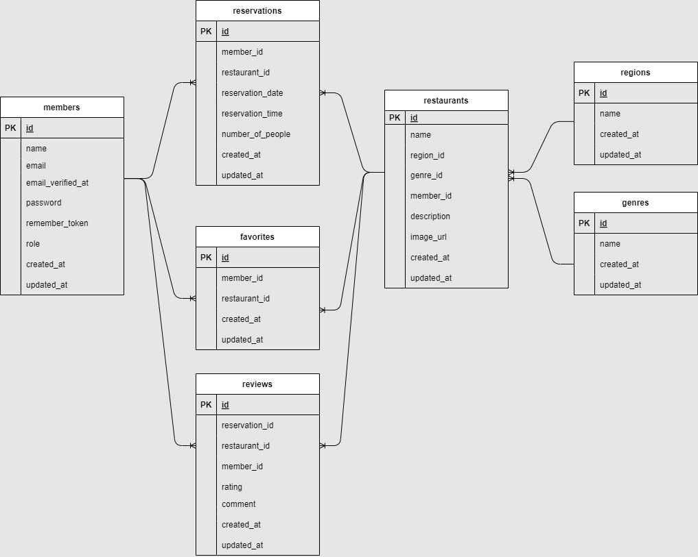

<p align="center"><a href="https://laravel.com" target="_blank"></a></p>

<p align="center">
<a href="https://travis-ci.org/laravel/framework"></a>
<a href="https://packagist.org/packages/laravel/framework"></a>
<a href="https://packagist.org/packages/laravel/framework"></a>
<a href="https://packagist.org/packages/laravel/framework"></a>
</p>

# RESE プロジェクト

## プロジェクト概要

**RESE**は、飲食店の予約とレビュー管理を簡単に行えるシステムです。このプロジェクトは、Laravel をベースに構築されており、以下の機能を提供します：

-   飲食店の検索と閲覧
-   予約の作成・更新・削除
-   レビュー投稿・閲覧機能
-   お気に入り登録機能

## データベース設計

以下は、本プロジェクトで使用しているデータベースの ER 図です：



この ER 図は、各テーブル間のリレーションやカラム構造を視覚的に示しています。

## 使用技術

-   **フレームワーク**: Laravel 10.x
-   **データベース**: MySQL
-   **フロントエンド**: Blade テンプレートエンジン
-   **その他**: AWS（S3, EC2, RDS）を使用した本番環境構築

## セットアップ手順

1. リポジトリをクローン
    ```bash
    git clone https://github.com/<your-repository>/rese.git
    cd rese
    ```
2. 環境設定ファイルを作成
   cp .env.example .env
3. 必要な依存関係をインストール
   composer install
   npm install
   npm run dev
4. データベースをマイグレーション
   php artisan migrate
5. 開発サーバーを起動
   php artisan serve

ライセンス
このプロジェクトは、MIT ライセンスの下で公開されています。

---

### **ポイント**

1. **元の README の構造を活かす**

    - Laravel のロゴやリンクはそのまま残し、プロジェクトに合った内容を追記。

2. **ER 図を追加**

    - `` で ER 図を簡単に挿入。

3. **プロジェクト独自の情報を反映**
    - プロジェクト名、機能、セットアップ手順、使用技術などを具体的に記述。

---

この README をベースに、さらに必要に応じて調整
